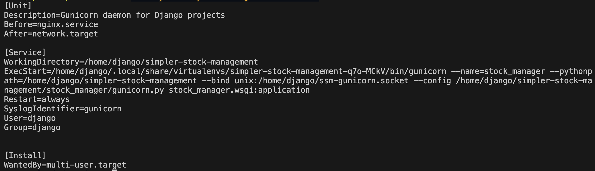

# Simpler Stock Management (Beta)

Simpler Stock Management is a web application designed to help manage warehouse and shop stock efficiently. The application provides features for searching, sorting, updating, and transferring stock items between the warehouse and shops. Data is stored in a local SQLite3 database.

Note, this is an early beta release. It is intended for testing only, and is not yet suitable for production deployment.

This is an entire rewrite of the earlier (pre-V5) 'Simple Stock Management' app, from scratch. Little-used functionality has been removed and the code is now simpler and [more maintainable](#what-changed). The earlier legacy version is now unmaintained, however the code may still be accessed in the [legacy_v4 branch](https://github.com/consciousuniverse/simple-stock-management/tree/legacy_v4).

## Security

This app has not been audited for security and probably does contain vulnerabilities that could expose data contained on the host system to unauthorized manipulation or disclosure. 
Deploy at your own risk and on a server that has **no access** to your primary systems, or indeed any system where compromise could reveal personally identifiable information or other sensitive data. For example, a standalone VPS machine. Please also remember to remotely back up the sqlite database.

In addition, regular updates of Python dependencies to the latest versions is necessary, to ensure patching of any discovered vulnerabilities (this may be achieved through your python package manager, such as pip or pipenv).

## Features

### User Authentication
- **Login/Logout**: Users can log in and log out of the application.
- **User Status**: Displays the logged-in user's status.
- **Brute Force Protection**: Manager & shop user logins protected from brute-force login attempts.

### Stock Management
- **Warehouse Stock**: View and manage items in the warehouse.
- **Shop Stock**: View items available in the shop.
- **Transfers Pending**: View and manage pending stock transfers.

### Search and Sort
- **Search**: Search for items in the warehouse and shop by SKU, description, or other attributes.
- **Sort**: Sort items by SKU, description, retail price, or quantity.

### Warehouse Maintenance
- **Toggle Warehouse Maintenance Mode**: Managers can toggle 'maintenance mode', during which transfers by shop users are paused.
- **Add, Update & Delete Stock**: Managers can add new stock items, update stock item descriptions, retail prices, and quantities, and delete items. All updates occur immedately the field is edited - no need to click any additional buttons.

### Transfer Items
- **Transfer Items**: Shop users can request to transfer items from the warehouse to the shop by simply entering how many units they require into the input field. The item is thereby instantly added to the 'Transfers Pending' panel. Quantities may be amended, or the transfer cancelled prior to sending the request. Clicking the 'Send Transfer Request' button submits the request, after which it can no longer be amended.
- **Complete Transfers**: Managers can modify, dispatch, and cancel pending transfers from the warehouse to the shops. Warehouse inventory is only reduced - and shop inventory increased - after managers have actioned the dispatch on the system. Dispatched items are immediately removed from the shop user's 'Transfers Pending' panel.

## Live demo

Coming soon...

## Screenshots

### Warehouse manager's view

### Shop view

## What changed?

The backend is still Django Rest Framework, while the frontend is now plain old jQuery, rather than relying on ReactJS with all its dependencies. The frontend is now integrated into the Django app, as opposed to the previous standalone frontend UI.

## Suggested installation steps on a Linux system

- Create a local user with minimal privileges to run the app (e.g., 'django'); make the app's root directory; and `cd` into that directory.
- Clone the repo.
- Install the python dependences. This project uses pipenv to install in a virtual environment, but a requirements.txt file has also been generated for pip install.
- Copy .env_default to .env.
- Configure the .env file you just copied. Be sure to set debug to False if publicly accessible, and configure your allowed hosts correctly.
- Create the log file at the location you specificed in the .env file (ensure this is writeable by the 'django' user)
- Generate a Django secret key with this one-liner: `python -c 'from django.core.management.utils import get_random_secret_key; print(get_random_secret_key())'`.
- Set up your forwarding (reverse proxy) web server, and configure 'systemd' to run gunicorn. As an example: by creating this file `/etc/systemd/ssm-gunicorn.service` with this content:

    
- Do the database migrations, i.e., from the project root run: `python manage.py makemigrations`, `python makemigrations stock_manager`,  then `python manage.py migrate`.
- Start the 'systemd' service, and enable at boot: `systemctl start ssm-gunicorn` and `systemctl enable ssm-gunicorn`.
- Create the superuser, i.e., from the project root run: `python manage.py createsuperuser`.
- Login to the admin section with your superuser (e.g., https://your-site.domain/admin) and create your warehouse manager user and shop users.
- Still in the admin section, create the 'managers', 'shop_users' and 'receive_mail' user groups.
- Assign the warehouse manager user to the 'managers' group, the shop users to the 'shop_users' group, and those managers who you wish to receive notification emails to the 'receive_mail' group.

Remeber not to host the app on a server containing any personal or other sensitive information, as it has not been vetted for security, and cannot be considered secure!

## License

Simpler Stock Management is licensed under the GPLv3. See the [LICENSE](LICENSE) file for more details.

## Author

Dan Bright - [GitHub](https://github.com/consciousuniverse), github@bright.contact