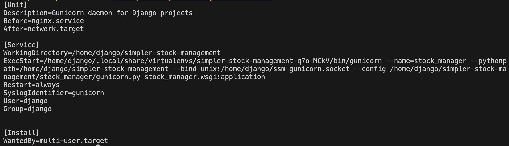

# Simpler Stock Management (Beta)

Simpler Stock Management is a web application designed to help manage warehouse and shop stock efficiently. The application provides features for searching, sorting, updating, and transferring stock items between the warehouse and shops. Data is stored in a local SQLite3 database.

Note, this is an early beta release. It is intended for testing only, and is not yet suitable for production deployment.

This is an entire rewrite of the earlier (pre-V5) 'Simple Stock Management' app, from scratch. Little-used functionality has been removed and the code is now simpler and [more maintainable](#what-changed). The earlier legacy version is now unmaintained, however the code may still be accessed in the [legacy_v4 branch](https://github.com/consciousuniverse/simple-stock-management/tree/legacy_v4).

[Live demo available below](#live-demo).

## Security

A focused security review (carried out over two passes) was undertaken for the v5.3.0-beta release. The issues it identified — including a stored cross-site scripting (XSS) flaw, a broken access-control check on item creation, an insecure direct object reference on transfer cancellation, and spreadsheet formula injection on export — have been fixed, and defence-in-depth measures added (a Content-Security-Policy, HTTPS/secure-cookie hardening, read-only stock endpoints, output escaping in the dashboard and notification emails, and non-revealing API error messages). See the [release notes](RELEASE_NOTES.md) for the full list.

This is **not** a substitute for a professional third-party audit, and the app has not undergone one. Undiscovered vulnerabilities may still exist. Please continue to deploy conservatively:

- Deploy on a server that has **no access** to your primary systems, or indeed any system where compromise could reveal personally identifiable information or other sensitive data — for example, a standalone VPS machine.
- Remember to remotely back up the sqlite database.
- Keep the Python dependencies updated to the latest versions, to ensure patching of any discovered vulnerabilities (this may be achieved through your python package manager, such as pip or pipenv).
- Run behind a TLS-terminating reverse proxy (see the installation steps below); with `DEBUG=False` the app enables secure cookies, HSTS and HTTPS redirection, and expects the proxy to set the `X-Forwarded-Proto` header.

## Features & Usage

### User Authentication

- **Login/Logout**: Users can log in and log out of the application.
- **User Status**: Displays the logged-in user's status.
- **Brute Force Protection**: Manager & shop user logins protected from brute-force login attempts.

### Stock Management

- **Warehouse Stock**: View and manage items in the warehouse.
- **Shop Stock**: View items available in the shop.
- **Transfers Pending**: View and manage pending stock transfers.
- **Download Stock Data**: Both warehouse and shop stock data may be downloaded as an excel spreadsheet.
- **Upload Stock Data**: Both warehouse and shop stock data may be uploaded as an excel spreadsheet and ingested into the database. The spreadsheet is considered the 'source of truth'! Important note: the unique identifer for each record is the SKU.
  - If records exist in the spreadsheet but not in the database, they are added to the database.
  - If records on the spreadsheet differ, the database is updated.
  - If records already in the database are not present on the spreadsheet, they are deleted from the database (this is optional and may be configured though a checkbox on the system admin page).
  - Excel spreadsheets may be uploaded either in the system default schema (i.e., what you get when you download the warehouse and shop inventories), or in a custom schema. If uploading a custom schema, a conversion function file may be added to translate your spreadsheet columns into the system schema (an example custom function is included).
- **Customise Pagination**: Change displayed rows per table through the system admin page.

### Search and Sort

- **Search**: Search for items in the warehouse and shop by SKU, description, or other attributes.
- **Sort**: Sort items by SKU, description, retail price, or quantity. SKU field uses a natural sort algorithm.

### Warehouse Maintenance

- **Toggle Warehouse Maintenance Mode**: Managers can toggle 'maintenance mode', during which transfers by shop users are paused.
- **Add, Update & Delete Stock**: Managers can add new stock items, update stock item descriptions, retail prices, and quantities, and delete items. All updates occur immediately the field is edited - no need to click any additional buttons.

### Transfer Items

- **Transfer Items**: Shop users can request to transfer items from the warehouse to the shop by simply entering how many units they require into the input field. The item is thereby instantly added to the 'Transfers Pending' panel. Quantities may be amended, or the transfer cancelled prior to sending the request. Clicking the 'Send Transfer Request' button submits the request, after which it can no longer be amended. The requested items remain on the shop user's 'Transfers Pending' panel in a disabled state, with a grey background, and appear on the warehouse manager's 'Transfers Pending' notification panel.
- **Email Notifications**: Email notifications may be activated, which sends an email to all warehouse managers in the 'receive_mail' group once a shop user clicks the 'Send Transfer Request' button. This email contains a list of all requested items, and includes the SKU, description, unit price and requested quantity.
- **Complete Transfers**: Managers can modify, dispatch, and cancel pending transfers from the warehouse to the shops. Warehouse inventory is only reduced - and shop inventory increased - after managers have clicked the 'Dispatch' button. Dispatched (or Cancelled) items are then removed from the shop user's 'Transfers Pending' panel.

## Developer Contact & Support

If you'd like to discuss options to have this application installed and/or maintained on your behalf, or just have comments or suggestions, feel free to get in touch <github@danbright.uk>.

## Live demo

Try the live demo at: [https://ssm.danbright.uk](https://ssm.danbright.uk).

(Note that some functionality has been disabled in the demo, such as file uploads and password changes. Also, if two or more people are signed onto the demo with the same username at the same time, you will observe unexpected changes to the data - YMMV!).

Warehouse manager login:

- Username: demo_manager
- Password: Gui7u6QxWEdZwq

Shop user login:

- Username: demo_shop_user
- Password: Gui7u6QxWEdZwq

## Screenshots

### Warehouse manager's view


### Shop view


## What changed?

The backend is still Django Rest Framework, while the frontend is now plain old jQuery, rather than relying on ReactJS with all its dependencies. The frontend is now integrated into the Django app, as opposed to the previous standalone frontend UI.

## Suggested installation steps on a Linux system

- Create a local user with minimal privileges to run the app (e.g., 'django'); make the app's root directory; and `cd` into that directory.
- Clone the repo.
- Install the python dependencies. This project uses pipenv to install them in a virtual environment.
- Copy .env_default to .env.
- Configure the .env file you just copied. Be sure to set debug to False if publicly accessible, and configure your allowed hosts correctly.
- Create the log file at the location you specified in the .env file (ensure this is writeable by the 'django' user)
- Generate a Django secret key with this one-liner: `python -c 'from django.core.management.utils import get_random_secret_key; print(get_random_secret_key())'`.
- Set up your forwarding (reverse proxy) web server, and configure 'systemd' to run gunicorn. As an example: by creating this file `/etc/systemd/ssm-gunicorn.service` with this content:

    
    - Terminate TLS at the reverse proxy and ensure it sets/forwards the `X-Forwarded-Proto: https` header. With `DEBUG=False` the app enables secure cookies and HTTPS redirection and relies on this header (via `SECURE_PROXY_SSL_HEADER`) to recognise secure requests; without it you may see redirect loops or cookies that fail to set.
    - The app sends a Content-Security-Policy that allow-lists the jQuery and Bootstrap CDN hosts referenced by the templates. If you change those CDN URLs, update `CONTENT_SECURITY_POLICY` in `ssm/settings.py` to match.
- Do the database migrations, i.e., from the project root run: `python manage.py makemigrations`, `python manage.py makemigrations stock_manager`,  then `python manage.py migrate`.
- Start the 'systemd' service, and enable at boot: `systemctl start ssm-gunicorn` and `systemctl enable ssm-gunicorn`.
- Create the superuser, i.e., from the project root run: `python manage.py createsuperuser`.
- Login to the admin section with your superuser (e.g., <https://your-site.domain/admin>) and create your superadmin user, warehouse manager user, and shop users.
- Assign the 'staff status' permission to the warehouse manager user.
- Still in the admin section, create the 'managers', 'shop_users' and 'receive_mail' user groups.
- It's recommended to assign all 'SSM | App Configuration' permissions to the 'managers' group.
- Assign the warehouse manager user to the 'managers' group, the shop users to the 'shop_users' group, and those managers who you wish to receive notification emails to the 'receive_mail' group.
- Still in the admin section, head to SSM > App Configuration > Configuration Options to switch on/off uploads, upload deletions and notification emails.
- If you wish to use the notification email feature, you'd need an account with a mail provider. The installation described here uses Sparkpost, but this may be changed in the settings provided the correct version of Anymail is installed (via Pip or Pipenv).

Remember not to host the app on a server containing any personal or other sensitive information. Although a security review has been carried out (see the [Security](#security) section), the app has not undergone a professional third-party audit and should not be treated as guaranteed secure.

## Testing

The project ships with an automated test suite covering the models, REST API,
permissions, transfer workflow, spreadsheet import/export, email, and security
behaviour (pytest), plus Playwright browser-based end-to-end tests of the
frontend.

### First-time setup

The test tooling is a development-only dependency and is not required to run the
app in production (`pipenv install --deploy`). To install it in a development
checkout:

```bash
pipenv install --dev                     # pytest, pytest-django, pytest-playwright
pipenv run playwright install chromium   # one-time browser download for the e2e tests
```

### Running the tests

Run all commands from the project root:

```bash
pipenv run pytest                        # full suite (includes the browser e2e tests)
pipenv run pytest -m "not e2e"           # backend only — faster, no browser needed
pipenv run pytest -q                     # quieter output
pipenv run pytest tests/test_security.py # a single test file
pipenv run pytest -k transfer            # only tests whose name matches "transfer"
```

Notes:

- The suite uses a dedicated `ssm.settings_test` module (configured in
  `pytest.ini`), so it ignores your local `.env` and does not touch your real
  `db.sqlite3` — the test database is created and destroyed automatically.
- The end-to-end tests (marked `e2e`) drive a real headless Chromium browser
  and therefore need the `playwright install chromium` step above. If you are
  offline or want to skip them, use `-m "not e2e"` to run the backend tests
  only.

## License

Simpler Stock Management is licensed under the GPLv3. See the [LICENSE](LICENSE) file for more details.

## Current Version

v5.3.0-beta

See the [release notes](RELEASE_NOTES.md) for what changed.

## Author

Dan Bright - [GitHub](https://github.com/consciousuniverse), <github@danbright.uk>
